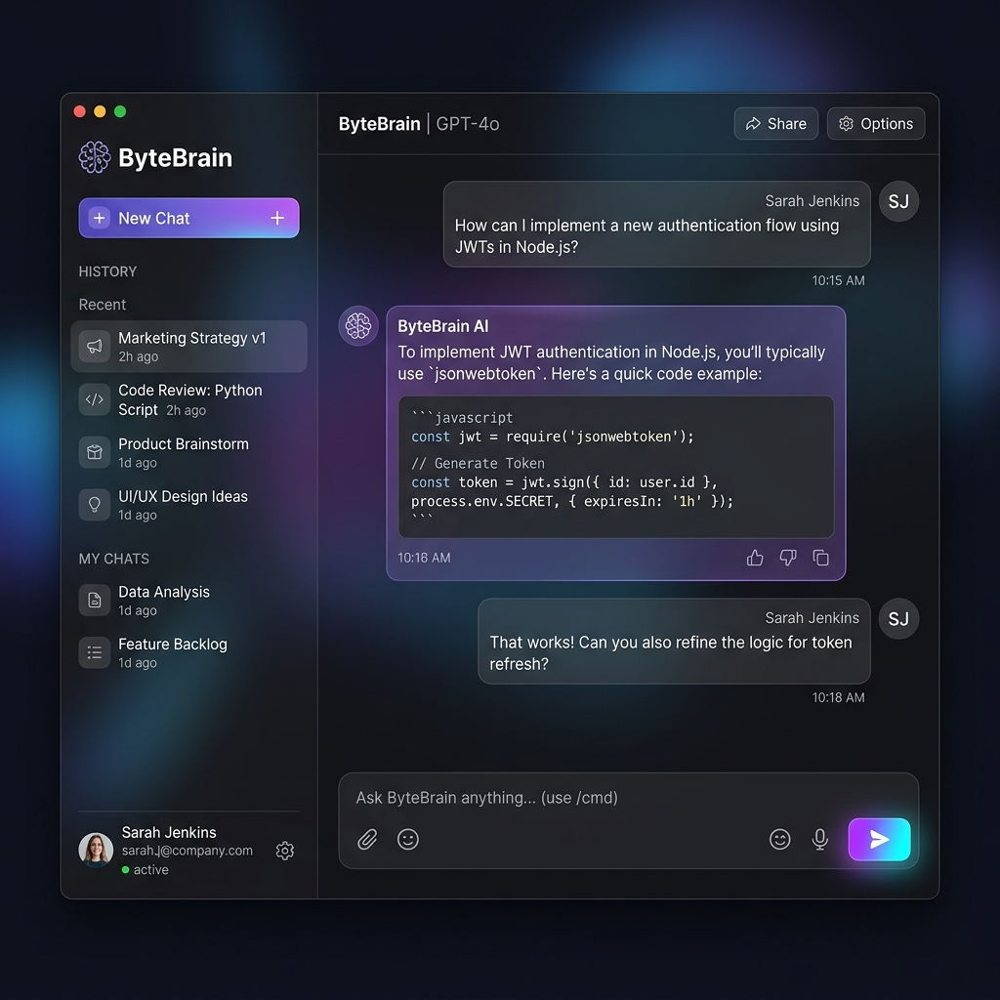

# ByteBrain 🧠

ByteBrain is a fully private, in-browser AI Study Companion. It runs powerful LLMs (Large Language Models) directly on your local device's GPU using WebLLM, meaning zero server costs, zero API keys, and 100% privacy.



## Features ✨

- **100% Private & Local:** Runs completely in your browser. Your notes, questions, and data never leave your device.
- **Smart Document Parsing:** Upload PDFs and Images. ByteBrain uses `pdfjs-dist` and `tesseract.js` to extract text instantly.
- **Hardware Accelerated:** Powered by WebGPU and `@mlc-ai/web-llm` to deliver blazing-fast AI responses using your local graphics card.
- **Beautiful UI:** A premium, dark-mode, glassmorphic interface built with React and custom CSS.
- **Non-blocking Worker:** Heavy AI processing is offloaded to a WebWorker so the UI remains perfectly smooth while the AI thinks.

## Tech Stack 🛠️

- **Frontend:** React, TypeScript, Vite
- **AI Engine:** WebLLM (Phi-3-mini-4k-instruct)
- **Document Processing:** PDF.js (PDFs), Tesseract.js (Images/OCR)
- **Icons:** Lucide React

## Getting Started 🚀

1. Clone the repository:
   ```bash
   git clone https://github.com/kamalesh4044/ByteBrain.git
   ```
2. Navigate into the directory and install dependencies:
   ```bash
   cd ByteBrain
   npm install
   ```
3. Start the development server:
   ```bash
   npm run dev
   ```
4. Open your browser and navigate to `http://localhost:5173`. 
   *(Note: The first time you ask a question, ByteBrain will download the AI model to your browser's local cache. Subsequent visits will load instantly!)*

## Deployment

ByteBrain can be hosted entirely for free on platforms like Vercel or Netlify. Since all AI processing happens on the client's device, backend hosting is strictly static!

---
*Built with ❤️ for better studying.*
